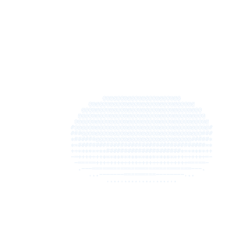

  

## Hi, I'm Rajeev 👋

**I'm a Software Engineer**

I like the feeling you get when someone uses something you've built and it works smoothly.

### Technologies

- **Languages:** Java, TypeScript, JavaScript, Python
- **Frontend:** Angular, React, Next.js
- **Backend:** Spring Boot, Django
- **Databases:** PostgreSQL, Redis
- **Cloud & Tools:** Docker, AWS, GCP, Git

### Currently working on

- Building production web applications
- Full-stack engineering
- Building MyFlow

### Interests

- Backend engineering
- Distributed systems
- Real-time applications

## Featured

- 🚀 **MyFlow** — Collaborative whiteboard built with Next.js, NodeJs Yjs, SpringBoot *(WIP)* [\[LINK\]](https://github.com/Dev-Code24/My-Flow-Frontend)
- ♟️ **MyChess** — Real-time multiplayer chess built with Spring Boot, Redis and WebSockets [\[LINK\]](https://github.com/Dev-Code24/My-Chess-Backend)
- 📈 **My Codeforces Journal** — Chrome extension with 180+ users for tracking competitive programming progress [\[LINK\]](https://github.com/Dev-Code24/My-Codeforces-Journal)